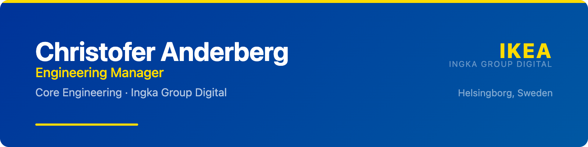

  

  <strong>Building the platform that 1,800+ IKEA engineers build on.</strong>

  <a href="https://www.linkedin.com/in/christofer-anderberg/">LinkedIn</a> &middot;
  Helsingborg, Sweden &middot;
  Ingka Group Digital

---

### `whoami`

Engineering Manager at **IKEA**, leading the **Core Engineering** team within Ingka Group Digital. Systems engineering background. Currently learning to code with the help of AI &mdash; some call it vibecoding, I call it the future.

---

### &#x1F6E0; What we build

<table>
  <tr>
    <td align="center" width="140"><strong>GitHub</strong> Enterprise Cloud, Actions, Copilot, GHAS</td>
    <td align="center" width="140"><strong>JFrog</strong> Artifactory across EU &amp; CN</td>
    <td align="center" width="140"><strong>Vault</strong> HashiCorp secrets management</td>
    <td align="center" width="140"><strong>Cloud CI</strong> GCP, Alicloud, AWS pipelines</td>
    <td align="center" width="140"><strong>Tooling</strong> VS Code, JetBrains, Docker</td>
  </tr>
</table>

---

### &#x1F4A1; What I'm interested in

- **AI-assisted development** &mdash; coding agents, prompt-driven workflows, and what it means for non-traditional developers
- **Platform engineering** &mdash; building internal platforms that make other teams faster
- **Developer experience** &mdash; reducing friction, improving visibility, making the right thing the easy thing
- **Systems thinking** &mdash; applying systems engineering principles to software organizations

---

### &#x1F331; Currently building

- An internal **metrics dashboard** that gives engineering leadership clear insight into platform costs, usage, and trends across all our capabilities
- This GitHub profile &mdash; with the help of AI, naturally

---

  Most repos here are things I've built while learning. They reflect a journey, not a destination.

  <strong>IKEA</strong> / Ingka Group Digital &middot; Core Engineering &middot; Helsingborg, Sweden

